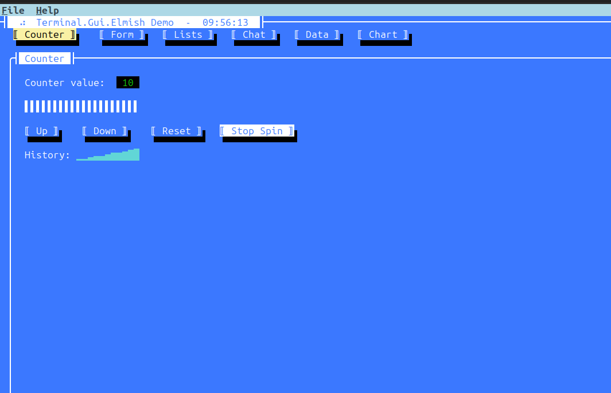
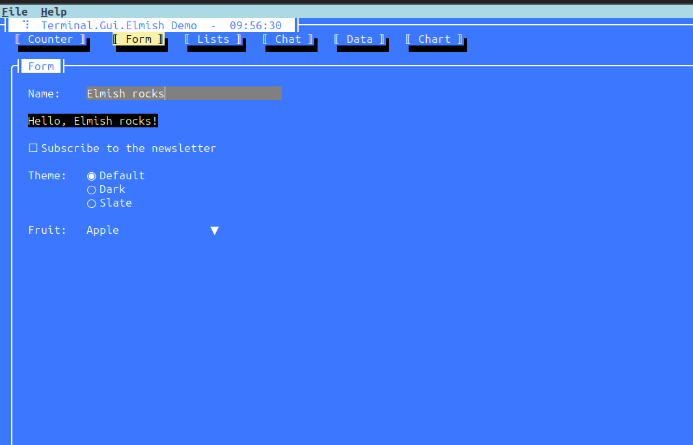
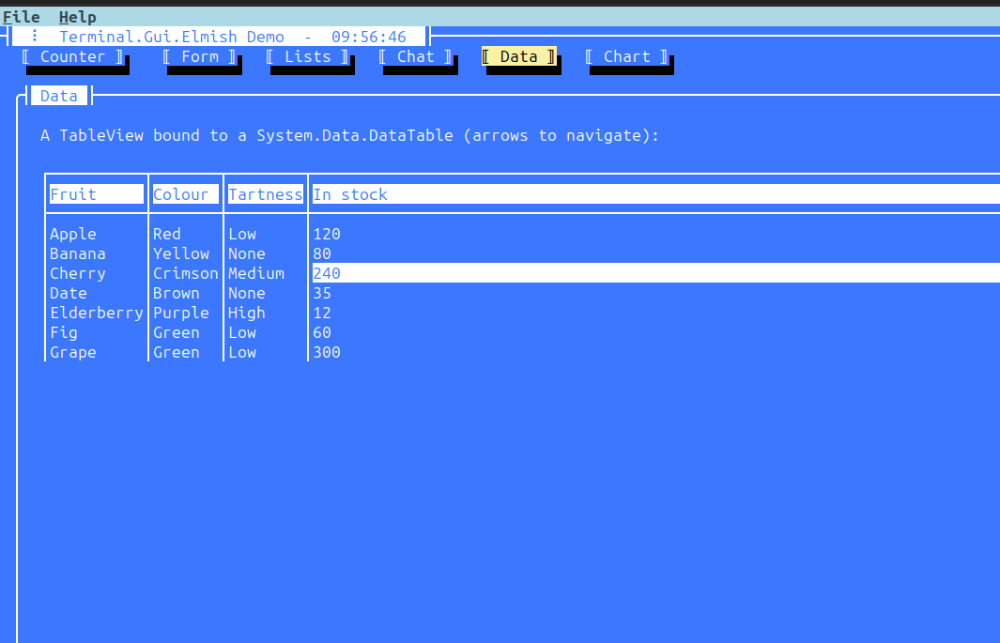

# Terminal.Gui.Elmish (v2)

An [Elmish](https://elmish.github.io/) (Model-View-Update) wrapper around
**[Terminal.Gui](https://github.com/gui-cs/Terminal.Gui) v2** with a Feliz-like view DSL for F#.

This is a **fork/port** of [**DieselMeister/Terminal.Gui.Elmish**](https://github.com/DieselMeister/Terminal.Gui.Elmish)
by **Daniel Hardt** — the original v1 wrapper — updated to Terminal.Gui v2. The binding layer
was rewritten against the v2 API; the consumer-facing DSL (`View.label [...]`, `prop.*`,
`Program.run`) is preserved where possible and modernized where v2 forced a change.

## Showcase

The `examples/Demo` app drives the whole DSL from a single Elmish program — menus, tabs,
forms, tables, live timers and more, all in the terminal.

**Counter** — reactive counter with progress bar, spinner timer and a sparkline of history.



**Form** — two-way bound form: text field, checkbox, radio group and combo box.



**Data** — `TableView` bound to a `System.Data.DataTable` with keyboard navigation.



## Quick start

This repo references Terminal.Gui v2 as a **git submodule** (the namespace-refactored
`develop` branch isn't on NuGet yet), so clone recursively:

```bash
git clone --recurse-submodules https://github.com/OnurGumus/Terminal.Gui.Elmish.V2
# already cloned? -> git submodule update --init --recursive

dotnet build src/Terminal.Gui.Elmish/Terminal.Gui.Elmish.fsproj
dotnet run --project examples/Counter
dotnet run --project examples/Showcase
dotnet run --project examples/Demo      # full-featured: menus, tabs, form, lists, live clock, dialog
```

```fsharp
open Terminal.Gui.Elmish

type Model = { Count: int }
type Msg = Inc | Dec

let init () = { Count = 0 }, Cmd.none
let update msg m =
    match msg with
    | Inc -> { m with Count = m.Count + 1 }, Cmd.none
    | Dec -> { m with Count = m.Count - 1 }, Cmd.none

let view m dispatch =
    View.page [ prop.children [
        View.window [ window.children [
            View.label  [ prop.position.x.center; prop.position.y.at 1; label.text $"Count: {m.Count}" ]
            View.button [ prop.position.x.center; prop.position.y.at 3; button.text "Up";   button.onClick (fun () -> dispatch Inc) ]
            View.button [ prop.position.x.center; prop.position.y.at 5; button.text "Down"; button.onClick (fun () -> dispatch Dec) ]
        ] ]
    ] ]

[<EntryPoint>]
let main _ = Program.mkProgram init update view |> Program.run; 0
```

## What changed from v1

| Area | v1 | v2 (this library) |
|---|---|---|
| App host | static `Application.Init/Run/Top` | instance `Application.Create().Init()`, runs a `Runnable` root |
| Root element | `Toplevel` | `View.page` → `Runnable` |
| Strings | `NStack.ustring` | plain `string` |
| Layout | `Pos.At`, `Dim.Sized`, `Percent(float)` | `Pos.Absolute`, `Dim.Absolute`, `Percent(int)`, `Dim.Auto` (via `prop.position.*`, `prop.width/height.*`) |
| Color | `ColorScheme` + role props | `Scheme` (`prop.scheme` / `prop.color(fg,bg)` / `prop.schemeName`) |
| Border | `BorderStyle` enum, `Effect3D` | `LineStyle` (`prop.borderStyle`); `Effect3D` removed |
| Sizing | `AutoSize` | removed (use `Dim.Auto`) |
| Button click | `Clicked` | `Accepted` (`button.onClick`) |
| CheckBox | `Checked`/`Toggled` | `CheckState`/`ValueChanged` (`checkBox.isChecked`/`onToggled`) |
| RadioGroup | `RadioGroup` | `OptionSelector` (`View.radioGroup`) |
| ComboBox | `ComboBox` | `DropDownList` (`View.comboBox`) |
| DateField/TimeField | `DateField` | `DatePicker` (`View.dateField`) |
| LineView | `LineView` | `Line` (`View.lineView`) |
| TabView | `TabView` + `Tab` | `Tabs` (`View.tabView`; each child's `prop.title` is the tab label) |
| Menus | v1 `MenuBar` | v2 `MenuBar`/`MenuItem` (`View.menuBar` + `menu.sub`/`menu.item`) |
| StatusBar | v1 status items | v2 `Shortcut`-based (`View.statusBar` + `statusItem.create`) |
| Events | reflection over private delegate fields | subscribe-once **event bridge** (latest handler swapped on update) |
| Dialogs | static `Application` context | use the running `IApplication` (`Dialogs.messageBox` etc.) |
| **Removed** | `ScrollView`, `PanelView` | gone in v2 — use a plain `View`/`FrameView` |

## Architecture

- **`Elements.fs`** — one `TerminalElement` per widget; each knows how to `create`,
  `update` (in place), and `canUpdate` its backing Terminal.Gui `View`.
- **`TreeDiff.fs`** — keyed reconciliation. Nodes are matched by `name + prop.id`
  (stable identity when `prop.id` is set; positional among same-kind siblings otherwise),
  updated in place when possible, recreated when the kind/identity changes, and disposed
  when removed. (The v1 differ sorted children by name, losing positional identity — fixed.)
- **`Interop.fs`** — the prop bag plus the event bridge that subscribes each CLR event
  exactly once and swaps the active handler on reconciliation (replaces the v1 reflection
  that poked private event backing fields).
- **`program.fs`** — the MVU host loop on the v2 instance `IApplication`: builds the initial
  tree, forces the first paint via `app.Invoke(LayoutAndDraw)`, runs the `Runnable`, and
  marshals off-thread (async `Cmd`) dispatches onto the UI thread via `app.Invoke`.

## Headless verification

Set `TGE_FORCE_DRIVER=dotnet` to use the `System.Console` driver (it honors a PTY's window
size and needs no ANSI-query handshake) when driving an app from a script/PTY for testing.

## Status

Core, all v1 widgets (mapped/modernized), the keyed diff, and the run loop are ported and
build clean against the local Terminal.Gui v2 (`net10.0`). The `Counter`, `Showcase`, and
`Demo` examples are verified rendering and interacting. `GraphView` and `Wizard` expose a
`prop.ref` escape hatch for their richer imperative APIs.

## NuGet package & CI

The package id is **`OnurGumus.Terminal.Gui.Elmish`** (the original `Terminal.Gui.Elmish`
belongs to Daniel Hardt). Because Terminal.Gui v2 with the current namespaces isn't published,
the package is **self-contained**: `Terminal.Gui.dll` is bundled into `lib/`, and Terminal.Gui's
own runtime dependencies (Markdig, TextMateSharp, etc.) are declared as normal package
dependencies. Consumers just `dotnet add package OnurGumus.Terminal.Gui.Elmish` — no extra feed.

`.github/workflows/publish.yml` builds Terminal.Gui from the submodule, packs the wrapper as
`2.0.0-ci.<run-number>`, and publishes to NuGet.org on every push to `master` via
**Trusted Publishing (OIDC)** — no API key stored.

To enable publishing (one-time, on NuGet.org):

1. Sign in to NuGet.org → your account → **Trusted Publishing** → add a policy:
   - Repository owner: `OnurGumus`, repository: `Terminal.Gui.Elmish.V2`
   - Workflow file: `publish.yml`
   - Package: `OnurGumus.Terminal.Gui.Elmish` (a new-package/glob policy works for the first push)
2. In the GitHub repo → Settings → Secrets and variables → Actions → **Variables**, add
   `NUGET_USER` = your NuGet.org username.

Until then the workflow still builds, packs, and uploads the `.nupkg` as a build artifact.

## Credits

- **Original project:** [DieselMeister/Terminal.Gui.Elmish](https://github.com/DieselMeister/Terminal.Gui.Elmish)
  by **Daniel Hardt** — the Elmish wrapper and the Feliz-like DSL this repo is built on.
- **Terminal.Gui:** the [gui-cs/Terminal.Gui](https://github.com/gui-cs/Terminal.Gui) team —
  the underlying cross-platform TUI toolkit.
- **Elmish:** the [Elmish](https://github.com/elmish/elmish) project — the MVU core
  (`Cmd`, `Program`, `RingBuffer`) is adapted from it, as in the original wrapper.

This v2 port reuses the original's architecture and public API; the binding layer and host
loop were rewritten for Terminal.Gui v2.

## License

Released into the public domain under [The Unlicense](LICENSE.txt), the same license as the
original project. No warranty. See `LICENSE.txt` for details.
